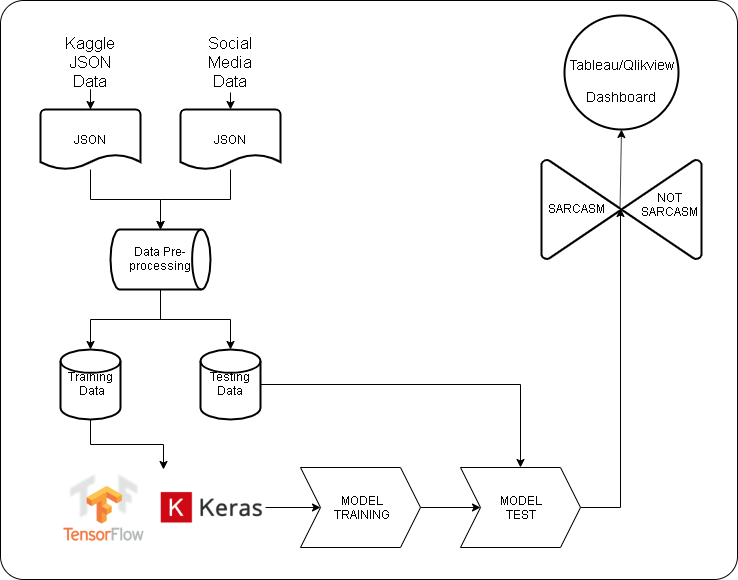

# Project Name: SarcasmDetect
Description: Based on sarcastic (The Onion) and non-sarcastic headlines (HuffPost), the system would help in sarcastic headline awareness and detection. We are diving into sarcastic commentary to see if we can predict sarcasm in a headline.

# Abstract
A business needs to drive product marketing, sales, and operations according to the user feedback, product market fit, and public sentiment. The user feedback cycle, driven by dopamine generative experiences, is very clear and there product managers hired with the sole responsibility to make sure the user's are 'hooked' to the product. Companies like Mixpanel have built industry leading software to understand the meaning behind each user activity to understand UX friction to help their customers get closer to product market fit. Social media analysis is currently avaliable via companies like Sprinklr, but they rely heavily on existing marketing, ads, and social sentiment campaign data to tell their clients whether certain sentiment behind a certain ad was postivie or negative. In a nutshell, they can only analyze social media sentiment based on past sentiment and tell their customers if they are doing well or worse. 

But there is a missing link. Sarcasm Detection for business use case is that link. We intend to provide a way for businesses to use our tool to help them understand if the media sentiment they see from other tools is actually the sentiment the users/media is expressing or if its sarcasm. We intend to use a Kaggle dataset of news headlines (https://www.kaggle.com/rmisra/news-headlines-dataset-for-sarcasm-detection) and also try to use small sized posts from media platforms and apply similar logic to understand posts behind a 'trending' topic on a social media platform. 

> Our main goal is to get a working prototype with the Kaggle dataset. The Kaggle dataset's point, according to the dataset description, was to circumvent the noise in Twitter data. We will move to social media data once we can have satisfying outcome from Kaggle.

# Architecture Diagram 

# Tech stack
* Datasets: Kaggle dataset (json), Social media APIs, Cornell sarcasm dataset (For training the model)
* ML frameworks: SKlearn, Tensor flow, Pandas, NLTK/Stanford NER  
* Visualization: Tableau
* Web application: ReactJS
* Cloud/Infra Platform: AWS EC2, docker, MongoDB
* To be determined

###### Original Professor Feedback :- If you can bring NER to pin point people, product or processes for sarcasm detection then it will be useful. Provide actionable insights based on NER so for ex. If you discover 50% sarcasm in the headlines / tweets about new samsung fold phone then samsung can learn a lot with further insight you provide on the article using NLP
